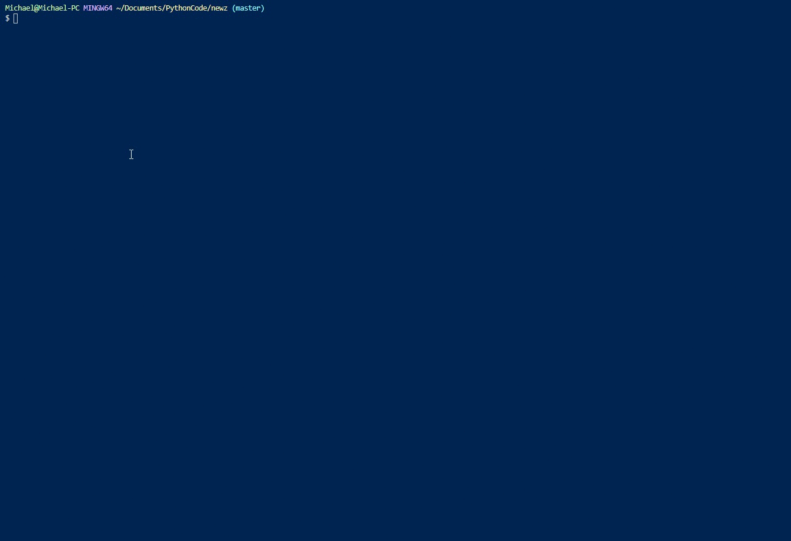

# Newz
Local news straight to your terminal. 

Newz utilizes [wego](https://github.com/schachmat/wego) for weather visualizations, and Yahoo for financial and headline data.

## Installation
`pip install newz`

## Dependencies
  * Python 2.7 or later
  * utf-8 terminal with 256 colors
  * An API key with [openweathermap](https://home.openweathermap.org/users/sign_up).

## Usage
To run **newz**, simply execute `python3 -m newz` or `newz` in your terminal/command line tool.

In order to accurately pull weather information, after signing up with [openweathermap](https://home.openweathermap.org/users/sign_up), you can either create an environment variable,
replace the WEATHER_KEY value in the newzconfig.py file.

Newz uses the geocoder library to obtain your geolocation to provide the data. If you wish to obtain different location's news, just apply the `-c` or `--city` flags along with the name of the city.

Under the Headlines section you can click on the link (CTRL + Click depending on the terminal) which will take you to the news article in your default browser.

## Contributing

1. Fork it (<https://github.com/msleone90/newz/fork>)
2. Create your feature branch (`git checkout -b feature/fooBar`)
3. Commit your changes (`git commit -am 'Add some fooBar'`)
4. Push to the branch (`git push origin feature/fooBar`)
5. Create a new Pull Request

## License

© Michael S Leone

Licensed under the [MIT License](../LICENSE)
